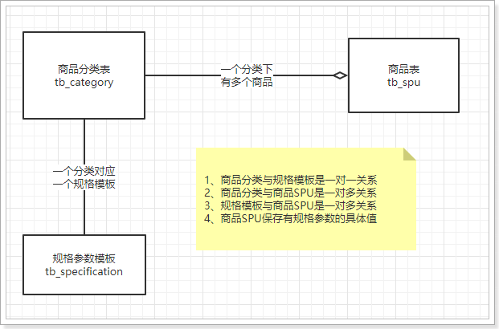

### 商品微服务：商品及商品分类、品牌、库存等的服务

商品的种类繁多，每一件商品，其属性又有差别。为了更准确描述商品及细分差别，抽象出两个概念：`SPU` 和 `SKU`
 - SPU：一组具有共同属性的商品集，SPU是一个抽象的商品集概念，为了方便后台的管理。
 - SKU：SPU商品集因具体特性不同而细分的每个商品，SKU才是具体要销售的商品，每一个SKU的价格、库存可能会不一样，用户购买的是SKU而不是SPU

举个例子：
 - `小米MIX3`就是一个`SPU`
 - 因为颜色、内存等不同，而细分出不同的`小米MIX3`，如亮黑色128G版，这就是`SKU`
 
不同的商品分类，可能属性是不一样的，比如手机有内存，衣服有尺码。但是商品的规格参数应该是与分类绑定的。每一个分类都有统一的规格参数模板，但不同商品其参数值可能不同。


SPU中会有一些特殊属性，用来区分不同的SKU，我们称为SKU特有属性，并且SKU的特有属性是商品规格参数的一部分。
也就是说，我们没必要单独对SKU的特有属性进行设计，它可以看做是规格参数中的一部分。这样规格参数中的属性可以标记成两部分：
 - 所有sku共享的规格属性（称为全局属性）
 - 每个sku不同的规格属性（称为特有属性）


规格参数中的数据，将来会有一部分作为搜索条件来使用。我们可以在设计时，将这部分属性标记出来，将来做搜索的时候，作为过滤条件。

搞了张`tb_specification`表，用来记录每个类型商品的参数规格信息：

```mysql
CREATE TABLE `tb_specification` (
  `category_id` bigint(20) NOT NULL COMMENT '规格模板所属商品分类id',
  `specifications` varchar(3000) NOT NULL DEFAULT '' COMMENT '规格参数模板，json格式',
  PRIMARY KEY (`category_id`)
) ENGINE=InnoDB DEFAULT CHARSET=utf8 COMMENT='商品规格参数模板，json格式。';
```
其中`specifications`字段用`json`格式来记录`category_id`对应类型商品的参数规格信息：

以`主芯片`这一组为例：

- group：注明，这里是主芯片
- params：该组的所有规格属性，因为不止一个，所以是一个数组。这里包含四个规格属性：CPU品牌，CPU型号，CPU频率，CPU核数。每个规格属性都是一个对象，包含以下信息：
  - k：属性名称
  - searchable：是否作为搜索字段，将来在搜索页面使用，boolean类型
  - global：是否是SPU全局属性，boolean类型。true为全局属性，false为SKU的特有属性
  - options：属性值的可选项，数组结构。起约束作用，不允许填写可选项以外的值，比如CPU核数，有人添10000核岂不是很扯淡
  - numerical：是否为数值，boolean类型，true则为数值，false则不是。为空也代表非数值
  - unit：单位，如：克，毫米。如果是数值类型，那么就需要有单位，否则可以不填。

搞了张`tb_spu`表，用来记录spu信息：

```mysql
CREATE TABLE `tb_spu`
(
    `id`               bigint(20)   NOT NULL AUTO_INCREMENT COMMENT 'spu id',
    `title`            varchar(128) NOT NULL DEFAULT '' COMMENT '标题',
    `sub_title`        varchar(256)          DEFAULT '' COMMENT '子标题',
    `cid1`             bigint(20)   NOT NULL COMMENT '1级类目id',
    `cid2`             bigint(20)   NOT NULL COMMENT '2级类目id',
    `cid3`             bigint(20)   NOT NULL COMMENT '3级类目id',
    `brand_id`         bigint(20)   NOT NULL COMMENT '商品所属品牌id',
    `saleable`         tinyint(1)   NOT NULL DEFAULT '1' COMMENT '是否上架，0下架，1上架',
    `valid`            tinyint(1)   NOT NULL DEFAULT '1' COMMENT '是否有效，0已删除，1有效',
    `create_time`      datetime              DEFAULT NULL COMMENT '添加时间',
    `last_update_time` datetime              DEFAULT NULL COMMENT '最后修改时间',
    PRIMARY KEY (`id`)
) ENGINE = InnoDB
  AUTO_INCREMENT = 196
  DEFAULT CHARSET = utf8 COMMENT ='spu表，该表描述的是一个抽象性的商品，比如 iphone8';
```

因为有些大字段可能会影响查询效率，所以对其坐了垂直拆分，搞了张`tb_spu_detail`表：

```mysql
CREATE TABLE `tb_spu_detail`
(
    `spu_id`        bigint(20)    NOT NULL,
    `description`   text COMMENT '商品描述信息',
    `generic_spec`  varchar(2048) NOT NULL DEFAULT '' COMMENT '通用规格参数数据',
    `special_spec`  varchar(1024) NOT NULL COMMENT '特有规格参数及可选值信息，json格式',
    `packing_list`  varchar(1024)          DEFAULT '' COMMENT '包装清单',
    `after_service` varchar(1024)          DEFAULT '' COMMENT '售后服务',
    PRIMARY KEY (`spu_id`)
) ENGINE = InnoDB
  DEFAULT CHARSET = utf8;
```
其中 `generic_spec` 字段用`json`格式来记录spu通用规格参数键值对，`special_spec` 字段用 `json` 格式来记录sku的特有规格参数及可选值信息

搞了张`tb_sku`表，用来记录sku信息：

```mysql
CREATE TABLE `tb_sku`
(
    `id`               bigint(20)   NOT NULL AUTO_INCREMENT COMMENT 'sku id',
    `spu_id`           bigint(20)   NOT NULL COMMENT 'spu id',
    `title`            varchar(256) NOT NULL COMMENT '商品标题',
    `images`           varchar(1024)         DEFAULT '' COMMENT '商品的图片，多个图片以‘,’分割',
    `price`            bigint(15)   NOT NULL DEFAULT '0' COMMENT '销售价格，单位为分',
    `indexes`          varchar(32)           DEFAULT '' COMMENT '特有规格属性在spu属性模板中的对应下标组合',
    `own_spec`         varchar(1024)         DEFAULT '' COMMENT 'sku的特有规格参数键值对，json格式，反序列化时请使用linkedHashMap，保证有序',
    `enable`           tinyint(1)   NOT NULL DEFAULT '1' COMMENT '是否有效，0无效，1有效',
    `create_time`      datetime     NOT NULL COMMENT '添加时间',
    `last_update_time` datetime     NOT NULL COMMENT '最后修改时间',
    PRIMARY KEY (`id`),
    KEY `key_spu_id` (`spu_id`) USING BTREE
) ENGINE = InnoDB
  AUTO_INCREMENT = 27359021730
  DEFAULT CHARSET = utf8 COMMENT ='sku表,该表表示具体的商品实体,如黑色的 64g的iphone 8';
```

其中 `indexes` 字段记录了sku中的特有规格属性在spu特有属性模板中的对应下标组合， `own_spec` 字段则用 `json` 格式记录了sku的特有规格参数键值对