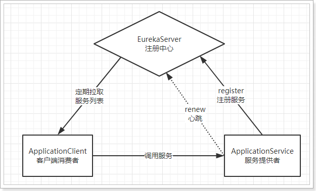

### eureka主要用于服务注册与发现

 Eureka主要用于服务注册与发现。
 
 Eureka包含两个组件：Eureka Server和Eureka Client。
 
 1. 服务提供者在启动时，向注册中心注册自己提供的服务。
 2. 服务消费者在启动时，向注册中心订阅自己所需的服务。
 3. 注册中心返回服务提供者地址给消费者。
 4. 服务消费者从提供者地址中调用消费者。
 
 #### Eureka Server
 
 提供服务注册服务，各个节点启动后，会在Eureka Server中进行注册，包括主机与端口号、服务版本号、通讯协议等。这样EurekaServer中的服务注册表中将会存储所有可用服务节点的信息，服务节点的信息可以在界面中直观的看到。
 
 Eureka服务端支持集群模式部署，首尾相连形成一个闭环即可。集群中的的不同服务注册中心通过异步模式互相复制各自的状态，这也意味着在给定的时间点每个实例关于所有服务的状态可能存在不一致的现象。
 
 #### Eureka Client
 
 主要处理服务的注册和发现。客户端服务通过注册和参数配置的方式，嵌入在客户端应用程序的代码中。在应用程序启动时，Eureka客户端向服务注册中心注册自身提供的服务，并周期性的发送心跳来更新它的服务租约。同时，他也能从服务端查询当前注册的服务信息并把它们缓存到本地并周期行的刷新服务状态。
 
 #### 服务调用
 
 服务消费者在获取服务清单后，通过服务名可以获取具体提供服务的实例名和该实例的元数据信息。
 因为有这些服务实例的详细信息，所以客户端可以根据自己的需要决定具体调用哪个实例。
 在`Ribbon`中会默认采用轮询的方式进行调用，从而实现客户端的负载均衡。
 
 
 
 #### Eureka高可用
 
 Eureka Server在Eureka服务治理设计中，所有节点既是服务的提供方，也是服务的消费方，服务注册中心也不例外。Eureka Server的高可用实际上就是将自己做为服务向其他服务注册中心注册自己。**这样就可以形成一组互相注册的服务注册中心，以实现服务清单的互相同步，达到高可用的效果**。
 
 - Eureka Server的同步遵循着一个非常简单的原则：只要有一条边将节点连接，就可以进行信息传播与同步。
   可以采用两两注册的方式实现集群中节点完全对等的效果，实现最高可用性集群，任何一台注册中心故障都不会影响服务的注册与发现。
 - 在注册服务之后，服务提供者会维护一个心跳用来持续汇报Eureka Server，我们称之为服务续约。
   否则Eureka Server的剔除任务会将该服务实例从服务列表中排除出去。默认情况下，如果Eureka Server在一定时间内没有接收到某个微服务实例的心跳，Eureka Server将会注销该实例。
 - 但是当网络分区故障发生时，微服务与Eureka Server之间无法正常通信，以上行为可能变得非常危险了。因为微服务本身其实是健康的，此时本不应该注销这个微服务。Eureka通过“自我保护模式”来解决这个问题。当Eureka Server节点在短时间内丢失过多客户端时（可能发生了网络分区故障），那么这个节点就会进入自我保护模式。一旦进入该模式，Eureka Server就会保护服务注册表中的信息，不再删除服务注册表中的数据。
   当网络故障恢复后，该Eureka Server节点会自动退出自我保护模式。